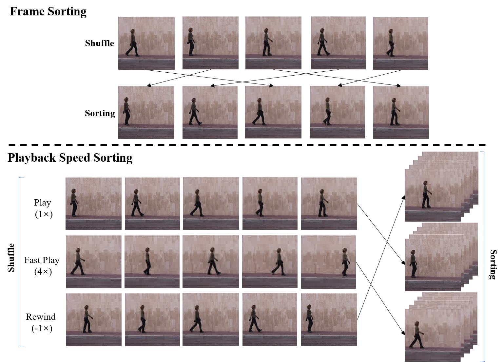

# Self-Supervised Spatio-Temporal Learning Using Variable Playback Speed Prediction
## Summary
This is the PyTorch code for the following paper:
[Self-Supervised Spatio-Temporal Representation Learning Using Variable Playback Speed Prediction](https://arxiv.org/abs/2003.02692)

Code will be released soon.

## Introduction

  

We introduce a novel self-supervised spatio-temporal representation learning via a variable video playback speed prediction (PSP) task, which plays a pivotal role in generating various types of clips from videos and learning the spatio-temporal structure of videos without any manual annotations.

  

We also propose a new layer-dependable temporal group normalization method for efficient 3D CNN learning under the large variations of appearance and temporal coherence at videos.
